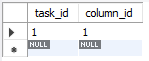

# Тестування працездатності системи

Цей проєкт показує базову реалізацію DAO (Data Access Object) для взаємодії з базою даних MySQL. Для цього була використана мова Java.

## Головний файл тестування ##
```java
package org.example;

import org.example.dao.*;
import org.example.model.*;

import java.sql.Connection;
import java.sql.DriverManager;
import java.sql.SQLException;
import java.time.LocalDateTime;
import java.time.format.DateTimeFormatter;

public class Main {
    public static void main(String[] args) {
        String db_url = "jdbc:mysql://localhost:3306/taskmanagementsystem";
        String db_user = "root";
        String db_password = System.getenv("MY_DB_PASSWORD");

        try (Connection connection = DriverManager.getConnection(db_url, db_user, db_password)) {
            System.out.println("Connected to database");

            UserDao userDao = new UserDao(connection);
            ProjectDao projectDao = new ProjectDao(connection);
            BoardDao boardDao = new BoardDao(connection);
            ColumnDao columnDao = new ColumnDao(connection);
            TaskDao taskDao = new TaskDao(connection);
            TaskColumnLinkDao taskColumnLinkDao = new TaskColumnLinkDao(connection);
            CommentDao commentDao = new CommentDao(connection);


            // Додання user
            User user = new User();
            user.setUsername("Vitaliy");
            user.setEmail("vitaliy12@gmail.com");
            user.setPasswordHash("password123");
            userDao.addUser(user);

            // Отримання user
            user = userDao.getUserByUsername("Vitaliy");
            System.out.println("User found: " + user);


            // Створення проєкту
            Project project = new Project();
            project.setTitle("Project A");
            project.setDescription("Description of Project A");
            project.setOwner_id(user.getId());
            projectDao.addProject(project);

            // Отримання проєкту
            project = projectDao.getProjectByOwner(user.getId());
            System.out.println("Project found: " + project);


            // Створення дошки
            Board board = new Board();
            board.setTitle("Board A");
            board.setProject_id(project.getId());
            boardDao.addBoard(board);


            // Створення стовпця
            Column column = new Column();
            column.setTitle("To do");
            column.setBoard_id(1);
            column.setOrder(1);
            columnDao.addColumn(column);


            // Створення завдання
            Task task = new Task();
            task.setTitle("Task A");
            task.setDescription("Description of Task A");
            task.setStart_date("2025-05-26");
            task.setEnd_date("2025-05-30");
            task.setStatus("Open");
            task.setProject_id(project.getId());
            task.setAssignee_id(user.getId());
            taskDao.addTask(task);


            // З'єднання завдання зі стовпцем
            TaskColumnLink taskColumnLink = new TaskColumnLink();
            taskColumnLink.setTask_id(1);
            taskColumnLink.setColumn_id(1);
            taskColumnLinkDao.addTaskColumnLink(taskColumnLink);


            // Додання коментаря
            Comment comment = new Comment();
            comment.setTask_id(1);
            comment.setAuthor_id(user.getId());
            comment.setContent("Comment A");
            LocalDateTime now = LocalDateTime.now();
            DateTimeFormatter formatter = DateTimeFormatter.ofPattern("yyyy-MM-dd HH:mm:ss");
            comment.setTimestamp(now.format(formatter));
            commentDao.addComment(comment);

        } catch (SQLException e) {
            e.printStackTrace();
        }
    }
}
```

## Результати тестування ##

Головний файл


Таблиця user


Таблиця project


Таблиця board


Таблиця column


Таблиця task


Таблиця taskcolumnlink




Таблиця comment


